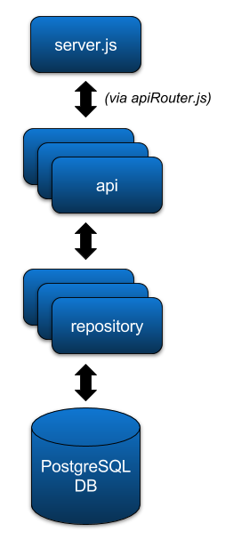

# FRA Platform architecture

## System architecture

FRA Platform consists of Javascript-based front-end which runs in the
browser and a [Node.js](https://nodejs.org/en/docs/) backend (also JavaScript) which talks to
PostgreSQL database. The only external services at the time of writing
are a standard SMTP server and Google authentication services.

As illustrated above, the runtime system is quite simple for now. 

## Main technologies

All libraries used in the application are listed in
[package.json](../package.json). The list below consists of the most
important ones with a brief explanation on why they are used.

### Libraries used in client and server

#### [Ramda](http://ramdajs.com/docs/)

Ramda is used to apply a [functional programming
paradigm](https://en.wikipedia.org/wiki/Functional_programming) for
JavaScript.

#### [bignumber.js](https://github.com/MikeMcl/bignumber.js/)

Used to make calculations more accurate than with built-in floating point
numbers (Javascript default). These calculations are slower than hardware
accelerated floating point ones. If a bottleneck appears somewhere which 
can be traced to bignumber calculations, there might be a need to use floating
points in such a case.

#### [i18next](https://www.i18next.com/)

Used for localization of UI texts and other messages. Also used on server.

### Client-side libraries and technologies

#### [ES2015](http://www.ecma-international.org/ecma-262/6.0/)

Client-side JavaScript is [transpiled](https://en.wikipedia.org/wiki/Source-to-source_compiler) 
from ES2015 version of JavaScript with WebPack to older, mostly ES5 version
which is supported better by current web browsers.

#### [WebPack](https://webpack.js.org/)

Used to create a single, optimized bundle of all the required JavaScript and
stylesheet files for the browser application.

#### [React](https://facebook.github.io/react/)

React is used for dynamically creating the Web application HTML from JavaScript
code.

#### [Redux](https://redux.js.org/)

Redux is used to store and manipulate shared client-side state for the Web
application. This means state which should be available to multiple components
within the application. 

#### [D3.js](https://d3js.org/)

Used to draw charts for the most important views. 

#### [Axios](https://github.com/axios/axios)

Used for [Ajax](https://en.wikipedia.org/wiki/Ajax_(programming)) 
HTTP requests from from browser to server.

#### [Less](http://lesscss.org/)

Used to add practical features to CSS and to make it easily bundlable with
Webpack.

### Server-side libraries

#### [Passport](http://www.passportjs.org/docs/)

Used to integrate google authentication service. Can be used to
integrate other authentication services as well.

#### [pg](https://www.npmjs.com/package/pg)

SQL queries to PostgreSQL database are used via this library.

#### [db-migrate](https://www.npmjs.com/package/db-migrate)

The database schema and it's initial data is created using this
library and SQL scripts. The SQL migrations are run on the startup
of the Node.js server (`server/db/migration/execMigrations.js`). 
Only the scripts which have not yet been applied are applied.

## Code organization

### Client-side (webapp/)

The client application application is divided in to subdirectories based on technical or
domain concepts. Here are some key diretories:

#### app

Contains the bootstrapping of the single-page application (routes,
fetching initial data etc)

#### userManagement

Managing and inviting users to a country.

#### assessmentFra

All the code to construct the views which are part of the FRA
assessment. For example: Extent of Forest, Growing Stock, ...

#### traditionalTable

Reusable framework for creating fixed-size, simple tables. Most of the
views (the simpler ones without charts and National Data Points) are created using this.

#### reusableUiComponents

Contains generic, reusable UI components which are used in many
places. For example a multi-select UI widget.

#### navigation

Contains the code needed to construct the navigation bar on the left.

#### review

All the reusable code related to commenting and showing comment indicators.

### Server-side (server/)

Most of the server code is about reading data from and
writing data to database and converting that data between JSON and raw
query results or query parameters.

Separate domain concepts have separate *api* modules and *repository*
modules. For example, the _descriptions_ which are visible as MS
Word-like rich text editors in the UI, are stored and retrieved on the
server-side with these modules:

* `server/descriptions/api.js`
* `server/descriptions/decriptionsRepository.js`

